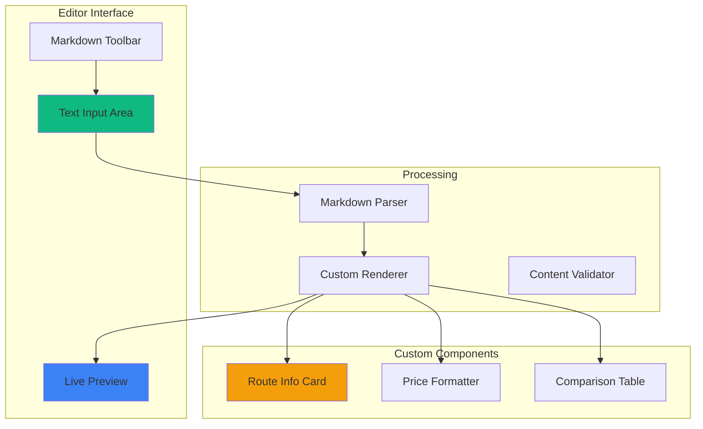

# CreatePostPage - Markdown & Flexible Content Features

## Overview
Menambahkan dukungan markdown lengkap dan structured route info untuk membuat platform komunikasi transportasi yang lebih fleksibel dan informatif.

## Markdown Editor Architecture



## Markdown Libraries

### Recommended Stack
```json
{
  "dependencies": {
    "react-markdown": "^9.0.0",
    "remark-gfm": "^4.0.0",
    "remark-breaks": "^4.0.0",
    "rehype-sanitize": "^6.0.0",
    "rehype-raw": "^7.0.0",
    "@uiw/react-md-editor": "^4.0.0"
  }
}
```

### Why Replace ReactQuill?
- ReactQuill: Rich text editor (WYSIWYG) → Output HTML
- Markdown: Plain text with syntax → More flexible, portable, version-control friendly
- Better for structured data (tables, code blocks, custom syntax)
- Easier to parse and extract route info
- Smaller bundle size
- Better mobile experience

## Custom Markdown Syntax

### 1. Route Info Card
```markdown
:::route
from: RS Al Islam
to: Bunderan Cibiru
mode: Angkot A
price: 5000
duration: 15 menit
distance: 3.5 km
notes: Lewat Jl. Soekarno-Hatta, turun di depan Indomaret
:::
```

**Rendered as:**
```
┌─────────────────────────────────────────┐
│ 🚐 Angkot A                             │
├─────────────────────────────────────────┤
│ 📍 RS Al Islam → Bunderan Cibiru        │
│ 💰 Rp 5.000                             │
│ ⏱️  15 menit • 3.5 km                   │
│                                         │
│ 📝 Lewat Jl. Soekarno-Hatta,           │
│    turun di depan Indomaret             │
└─────────────────────────────────────────┘
```

### 2. Price Tag
```markdown
Tarif: Rp 5.000
Atau gunakan shorthand: $5000 (auto-format ke Rp 5.000)
```

### 3. Route Comparison Table
```markdown
| Rute | Moda | Harga | Waktu | Keterangan |
|------|------|-------|-------|------------|
| Via Cicaheum | Angkot A | Rp 5.000 | 15 menit | Paling cepat |
| Via Cibiru | Angkot B | Rp 4.000 | 25 menit | Lebih murah |
| Via Cileunyi | Bus Damri | Rp 7.000 | 20 menit | Paling nyaman |
```

### 4. Schedule Block
```markdown
```schedule
KRL Bogor - Jakarta Kota
Stasiun Bogor:
- 05:00 | 05:30 | 06:00 | 06:30
- 07:00 | 07:30 | 08:00 | 08:30

Stasiun Manggarai:
- 05:45 | 06:15 | 06:45 | 07:15
- 07:45 | 08:15 | 08:45 | 09:15
```
```

### 5. Alert/Warning Blocks
```markdown
> ⚠️ **Peringatan**: Jalur ini sering macet jam 07:00-09:00

> 💡 **Tips**: Gunakan rute alternatif via Cibiru untuk menghindari macet

> 🚫 **Ditutup**: Jalan Soekarno-Hatta ditutup sementara (18 Mar - 20 Mar)
```

### 6. Location Tags
```markdown
@[RS Al Islam](lat:-6.9175,lng:107.6191)
@[Bunderan Cibiru](lat:-6.9234,lng:107.6543)
```

### 7. User Mentions
```markdown
@username - mention user
#TipsCepat - hashtag
```

## Route Info Builder Component

### Visual Interface
```
┌─────────────────────────────────────────────────────────┐
│ 📍 Rute Transportasi                                    │
├─────────────────────────────────────────────────────────┤
│                                                         │
│ Dari:  [RS Al Islam ▼]  🎯 Gunakan lokasi saya        │
│                                                         │
│ Ke:    [Bunderan Cibiru ▼]                             │
│                                                         │
│ Moda:  [🚐 Angkot] [🚌 Bus] [🚆 KRL] [🚕 Taksi]       │
│        [🏍️ Ojek] [🚶 Jalan Kaki]                      │
│                                                         │
│ Harga: Rp [5.000]  💡 Harga per orang                  │
│                                                         │
│ Waktu: [15] menit  |  Jarak: [3.5] km                  │
│                                                         │
│ Catatan:                                                │
│ ┌─────────────────────────────────────────────────┐   │
│ │ Lewat Jl. Soekarno-Hatta,                       │   │
│ │ turun di depan Indomaret                        │   │
│ └─────────────────────────────────────────────────┘   │
│                                                         │
│ [Preview] [Insert ke Post] [Simpan sebagai Template]  │
└─────────────────────────────────────────────────────────┘
```

### Component Props
```typescript
interface RouteInfoBuilderProps {
  onInsert: (markdown: string) => void;
  onSaveTemplate?: (template: RouteTemplate) => void;
  initialData?: Partial<RouteInfo>;
}

interface RouteInfo {
  from: string;
  fromLat?: number;
  fromLng?: number;
  to: string;
  toLat?: number;
  toLng?: number;
  mode: TransportMode;
  price: number;
  duration?: number; // minutes
  distance?: number; // km
  notes?: string;
  alternatives?: RouteInfo[]; // Alternative routes
}

type TransportMode = 
  | 'angkot' 
  | 'bus' 
  | 'krl' 
  | 'mrt' 
  | 'lrt' 
  | 'transjakarta'
  | 'taksi' 
  | 'ojek' 
  | 'walk' 
  | 'bike';
```

## Markdown Toolbar

### Toolbar Layout
```
┌────────────────────────────────────────────────────────────────┐
│ [B] [I] [S] | [H1] [H2] [H3] | [•] [1.] | ["] [</>] | [🔗] [📷] │
│                                                                │
│ [📍 Rute] [💰 Harga] [📊 Tabel] [⏰ Jadwal] | [👁️ Preview]    │
└────────────────────────────────────────────────────────────────┘
```

### Toolbar Actions
```typescript
const toolbarActions = {
  // Basic formatting
  bold: { icon: 'B', shortcut: 'Ctrl+B', syntax: '**text**' },
  italic: { icon: 'I', shortcut: 'Ctrl+I', syntax: '*text*' },
  strikethrough: { icon: 'S', shortcut: 'Ctrl+Shift+S', syntax: '~~text~~' },
  
  // Headers
  h1: { icon: 'H1', shortcut: 'Ctrl+Alt+1', syntax: '# ' },
  h2: { icon: 'H2', shortcut: 'Ctrl+Alt+2', syntax: '## ' },
  h3: { icon: 'H3', shortcut: 'Ctrl+Alt+3', syntax: '### ' },
  
  // Lists
  bulletList: { icon: '•', shortcut: 'Ctrl+Shift+8', syntax: '- ' },
  orderedList: { icon: '1.', shortcut: 'Ctrl+Shift+7', syntax: '1. ' },
  
  // Blocks
  quote: { icon: '"', shortcut: 'Ctrl+Shift+9', syntax: '> ' },
  code: { icon: '</>', shortcut: 'Ctrl+Shift+C', syntax: '```\n\n```' },
  
  // Media
  link: { icon: '🔗', shortcut: 'Ctrl+K', syntax: '[text](url)' },
  image: { icon: '📷', shortcut: 'Ctrl+Shift+I', action: 'openImageUpload' },
  
  // Custom
  route: { icon: '📍', shortcut: 'Ctrl+R', action: 'openRouteBuilder' },
  price: { icon: '💰', shortcut: 'Ctrl+P', syntax: 'Rp ' },
  table: { icon: '📊', shortcut: 'Ctrl+T', action: 'insertTable' },
  schedule: { icon: '⏰', shortcut: 'Ctrl+Shift+T', action: 'insertSchedule' },
  
  // View
  preview: { icon: '👁️', shortcut: 'Ctrl+Shift+P', action: 'togglePreview' },
  help: { icon: '?', shortcut: 'Ctrl+/', action: 'openMarkdownHelp' }
};
```

## Markdown Templates

### 1. Info Tarif Angkot
```markdown
# Info Tarif Angkot {Trayek}

:::route
from: {Titik Awal}
to: {Titik Akhir}
mode: Angkot {Trayek}
price: {Harga}
duration: {Waktu} menit
notes: {Catatan tambahan}
:::

## Rute yang Dilalui
- {Lokasi 1}
- {Lokasi 2}
- {Lokasi 3}

## Tips
> 💡 {Tips hemat atau tips perjalanan}

#InfoTarif #Angkot
```

### 2. Perbandingan Rute
```markdown
# Perbandingan Rute: {Asal} → {Tujuan}

| Rute | Moda | Harga | Waktu | Rating |
|------|------|-------|-------|--------|
| Via {Lokasi A} | {Moda} | Rp {Harga} | {Waktu} | ⭐⭐⭐⭐⭐ |
| Via {Lokasi B} | {Moda} | Rp {Harga} | {Waktu} | ⭐⭐⭐⭐ |
| Via {Lokasi C} | {Moda} | Rp {Harga} | {Waktu} | ⭐⭐⭐ |

## Rekomendasi
{Penjelasan rute mana yang paling recommended dan kenapa}

#PerbandinganRute #TipsCepat
```

### 3. Jadwal Transportasi
```markdown
# Jadwal {Moda Transportasi} - {Rute}

```schedule
{Nama Stasiun/Halte Awal}:
- {Jam 1} | {Jam 2} | {Jam 3} | {Jam 4}
- {Jam 5} | {Jam 6} | {Jam 7} | {Jam 8}

{Nama Stasiun/Halte Tujuan}:
- {Jam 1} | {Jam 2} | {Jam 3} | {Jam 4}
- {Jam 5} | {Jam 6} | {Jam 7} | {Jam 8}
```

> ⚠️ **Catatan**: Jadwal dapat berubah sewaktu-waktu

#Jadwal #InfoTransportasi
```

### 4. Tips Hemat Transportasi
```markdown
# Tips Hemat: {Rute}

## Opsi Termurah
:::route
from: {Asal}
to: {Tujuan}
mode: {Moda}
price: {Harga}
duration: {Waktu} menit
notes: Cara paling hemat!
:::

## Cara Menghemat
1. {Tips 1}
2. {Tips 2}
3. {Tips 3}

## Perbandingan Biaya

| Moda | Harga | Hemat |
|------|-------|-------|
| {Moda 1} | Rp {Harga} | - |
| {Moda 2} | Rp {Harga} | Rp {Selisih} |
| {Moda 3} | Rp {Harga} | Rp {Selisih} |

#TipsHemat #InfoTarif
```

## Custom Markdown Renderer

### React Component
```typescript
import ReactMarkdown from 'react-markdown';
import remarkGfm from 'remark-gfm';
import rehypeSanitize from 'rehype-sanitize';
import { RouteCard } from './RouteCard';
import { PriceTag } from './PriceTag';

interface MarkdownRendererProps {
  content: string;
  className?: string;
}

export function MarkdownRenderer({ content, className }: MarkdownRendererProps) {
  return (
    <ReactMarkdown
      className={className}
      remarkPlugins={[remarkGfm]}
      rehypePlugins={[rehypeSanitize]}
      components={{
        // Custom route card
        div: ({ node, className, children, ...props }) => {
          if (className === 'route-card') {
            return <RouteCard data={parseRouteData(children)} />;
          }
          return <div className={className} {...props}>{children}</div>;
        },
        
        // Auto-format prices
        p: ({ children }) => {
          const text = String(children);
          const priceRegex = /\$(\d+)/g;
          const formatted = text.replace(priceRegex, (_, price) => {
            return `Rp ${parseInt(price).toLocaleString('id-ID')}`;
          });
          return <p>{formatted}</p>;
        },
        
        // Enhanced tables
        table: ({ children }) => (
          <div className="overflow-x-auto">
            <table className="min-w-full divide-y divide-border-light">
              {children}
            </table>
          </div>
        ),
        
        // Custom blockquotes for alerts
        blockquote: ({ children }) => {
          const text = String(children);
          let type = 'info';
          if (text.includes('⚠️')) type = 'warning';
          if (text.includes('💡')) type = 'tip';
          if (text.includes('🚫')) type = 'danger';
          
          return (
            <blockquote className={`alert alert-${type}`}>
              {children}
            </blockquote>
          );
        },
        
        // Code blocks for schedules
        code: ({ className, children }) => {
          if (className === 'language-schedule') {
            return <ScheduleBlock content={String(children)} />;
          }
          return <code className={className}>{children}</code>;
        }
      }}
    >
      {content}
    </ReactMarkdown>
  );
}
```

### Route Card Component
```typescript
interface RouteCardProps {
  data: {
    from: string;
    to: string;
    mode: string;
    price: number;
    duration?: number;
    distance?: number;
    notes?: string;
  };
}

export function RouteCard({ data }: RouteCardProps) {
  const modeIcons = {
    angkot: '🚐',
    bus: '🚌',
    krl: '🚆',
    mrt: '🚇',
    taksi: '🚕',
    ojek: '🏍️',
    walk: '🚶'
  };
  
  return (
    <div className="route-card bg-surface-main border-2 border-brand-500/20 rounded-2xl p-6 my-4 shadow-lg">
      {/* Header */}
      <div className="flex items-center gap-3 mb-4">
        <span className="text-3xl">{modeIcons[data.mode.toLowerCase()] || '🚐'}</span>
        <h3 className="text-xl font-bold text-text-primary">{data.mode}</h3>
      </div>
      
      {/* Route */}
      <div className="flex items-center gap-2 mb-3 text-text-secondary">
        <MapPin size={18} className="text-brand-500" />
        <span className="font-medium">{data.from}</span>
        <ArrowRight size={18} />
        <span className="font-medium">{data.to}</span>
      </div>
      
      {/* Price */}
      <div className="flex items-center gap-2 mb-3">
        <Tag size={18} className="text-emerald-500" />
        <span className="text-2xl font-bold text-emerald-500">
          Rp {data.price.toLocaleString('id-ID')}
        </span>
      </div>
      
      {/* Duration & Distance */}
      {(data.duration || data.distance) && (
        <div className="flex items-center gap-4 mb-3 text-sm text-text-secondary">
          {data.duration && (
            <div className="flex items-center gap-1">
              <Clock size={16} />
              <span>{data.duration} menit</span>
            </div>
          )}
          {data.distance && (
            <div className="flex items-center gap-1">
              <Navigation size={16} />
              <span>{data.distance} km</span>
            </div>
          )}
        </div>
      )}
      
      {/* Notes */}
      {data.notes && (
        <div className="mt-4 pt-4 border-t border-border-light">
          <p className="text-sm text-text-secondary flex items-start gap-2">
            <Info size={16} className="mt-0.5 flex-shrink-0" />
            <span>{data.notes}</span>
          </p>
        </div>
      )}
    </div>
  );
}
```

## Auto-Extraction Feature

### Parse Route Info from Text
```typescript
function extractRouteInfo(text: string): RouteInfo | null {
  // Pattern: "dari X ke Y (naik/pakai/menggunakan) Z harga/tarif Rp? N"
  const patterns = [
    /dari\s+(.+?)\s+ke\s+(.+?)\s+(?:naik|pakai|menggunakan)\s+(.+?)\s+(?:harga|tarif)\s+(?:Rp\s*)?(\d+)/i,
    /(.+?)\s*→\s*(.+?)\s*\|\s*(.+?)\s*\|\s*(?:Rp\s*)?(\d+)/i,
    /rute:\s*(.+?)\s*-\s*(.+?)\s*\|\s*moda:\s*(.+?)\s*\|\s*harga:\s*(?:Rp\s*)?(\d+)/i
  ];
  
  for (const pattern of patterns) {
    const match = text.match(pattern);
    if (match) {
      return {
        from: match[1].trim(),
        to: match[2].trim(),
        mode: match[3].trim(),
        price: parseInt(match[4])
      };
    }
  }
  
  return null;
}

// Usage
const text = "dari RS Al Islam ke Bunderan Cibiru menggunakan Angkot A harga 5000";
const routeInfo = extractRouteInfo(text);
// → { from: "RS Al Islam", to: "Bunderan Cibiru", mode: "Angkot A", price: 5000 }
```

### Smart Suggestions
```typescript
function suggestRouteCard(content: string): boolean {
  const keywords = [
    'dari', 'ke', 'harga', 'tarif', 'rute', 'naik', 'pakai',
    'angkot', 'bus', 'krl', 'mrt', 'taksi', 'ojek'
  ];
  
  const lowerContent = content.toLowerCase();
  const matchCount = keywords.filter(kw => lowerContent.includes(kw)).length;
  
  // If 3+ keywords found, suggest route card
  return matchCount >= 3;
}

// Show suggestion banner
if (suggestRouteCard(content)) {
  showBanner({
    message: "Sepertinya kamu sedang menulis info rute. Mau pakai Route Card untuk tampilan lebih rapi?",
    action: "Buat Route Card",
    onAction: () => openRouteBuilder(extractRouteInfo(content))
  });
}
```

## Split-Screen Editor

### Layout Options
```typescript
type EditorLayout = 'edit' | 'preview' | 'split';

const layouts = {
  edit: { editor: '100%', preview: '0%' },
  preview: { editor: '0%', preview: '100%' },
  split: { editor: '50%', preview: '50%' }
};
```

### Component Structure
```tsx
<div className="editor-container">
  <div className="editor-header">
    <MarkdownToolbar />
    <div className="layout-switcher">
      <button onClick={() => setLayout('edit')}>Edit</button>
      <button onClick={() => setLayout('split')}>Split</button>
      <button onClick={() => setLayout('preview')}>Preview</button>
    </div>
  </div>
  
  <div className="editor-body" style={{ display: 'flex' }}>
    <div 
      className="editor-pane" 
      style={{ width: layouts[layout].editor }}
    >
      <textarea value={content} onChange={handleChange} />
    </div>
    
    <div 
      className="preview-pane" 
      style={{ width: layouts[layout].preview }}
    >
      <MarkdownRenderer content={content} />
    </div>
  </div>
</div>
```

## Mobile Optimization

### Touch-Friendly Toolbar
```tsx
// Swipeable toolbar for mobile
<div className="md:hidden">
  <Swiper spaceBetween={8} slidesPerView="auto">
    <SwiperSlide><ToolbarButton icon="B" /></SwiperSlide>
    <SwiperSlide><ToolbarButton icon="I" /></SwiperSlide>
    <SwiperSlide><ToolbarButton icon="📍" /></SwiperSlide>
    <SwiperSlide><ToolbarButton icon="💰" /></SwiperSlide>
    {/* ... more buttons */}
  </Swiper>
</div>
```

### Bottom Sheet for Route Builder
```tsx
// On mobile, show route builder as bottom sheet
<BottomSheet
  isOpen={showRouteBuilder}
  onClose={() => setShowRouteBuilder(false)}
  snapPoints={[0.9, 0.5]}
>
  <RouteInfoBuilder onInsert={handleInsert} />
</BottomSheet>
```

## Example Use Cases

### Use Case 1: Quick Price Info
**User types:**
```
Angkot dari RS Al Islam ke Bunderan Cibiru harga 5000
```

**System suggests:**
"Mau buat Route Card?"

**User clicks, gets:**
```markdown
:::route
from: RS Al Islam
to: Bunderan Cibiru
mode: Angkot
price: 5000
:::
```

### Use Case 2: Route Comparison
**User wants to compare 3 routes:**

1. Click "📊 Tabel" button
2. Select "Route Comparison" template
3. Fill in the table
4. Preview shows nicely formatted comparison

### Use Case 3: Schedule Info
**User wants to share KRL schedule:**

1. Click "⏰ Jadwal" button
2. Paste schedule data
3. System formats it into readable schedule block
4. Preview shows color-coded schedule

## Performance Considerations

### Lazy Loading
```typescript
// Lazy load markdown editor
const MarkdownEditor = lazy(() => import('./MarkdownEditor'));

// Lazy load route builder
const RouteInfoBuilder = lazy(() => import('./RouteInfoBuilder'));

// Show loading state
<Suspense fallback={<EditorSkeleton />}>
  <MarkdownEditor />
</Suspense>
```

### Debounced Preview
```typescript
// Debounce preview rendering to avoid lag
const debouncedContent = useDebounce(content, 300);

<MarkdownRenderer content={debouncedContent} />
```

### Memoization
```typescript
// Memoize expensive renders
const renderedContent = useMemo(
  () => <MarkdownRenderer content={content} />,
  [content]
);
```

## Migration Strategy

### Phase 1: Add Markdown Support (Keep ReactQuill)
- Add markdown editor as alternative
- Let users choose between WYSIWYG and Markdown
- Collect feedback

### Phase 2: Promote Markdown
- Show markdown benefits (route cards, tables, etc)
- Add migration tool (convert HTML to Markdown)
- Encourage new posts to use markdown

### Phase 3: Deprecate ReactQuill
- Make markdown default
- Keep ReactQuill for legacy posts
- Eventually remove ReactQuill

## Success Metrics

1. **Adoption Rate**
   - 70%+ users use markdown within 1 month
   - 50%+ posts include route cards
   - 30%+ posts use tables/comparisons

2. **Content Quality**
   - Average post length increases 50%
   - More structured information
   - Better readability scores

3. **User Satisfaction**
   - 4.5+ star rating for new editor
   - Reduced support tickets about formatting
   - Increased post engagement

4. **Performance**
   - Editor load time < 1s
   - Preview render time < 200ms
   - No lag during typing
