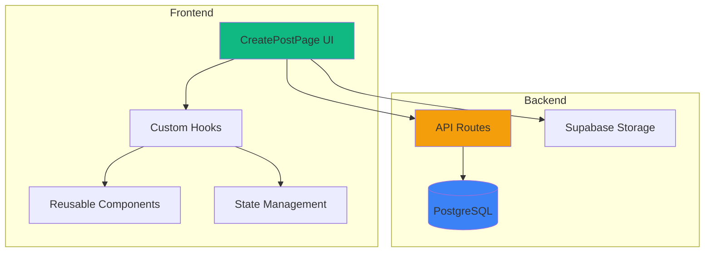
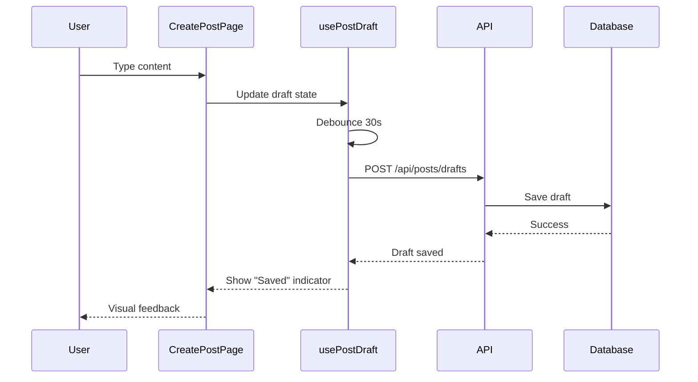
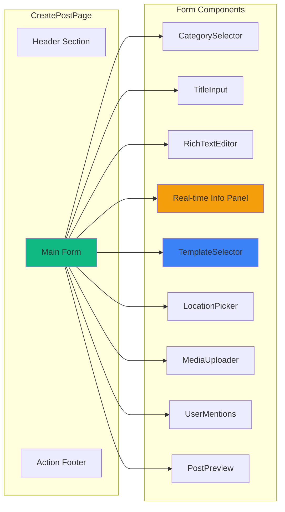

# CreatePostPage Revamp - Technical Architecture

## Overview
Revamp komprehensif untuk CreatePostPage dengan fokus pada komunikasi transportasi real-time yang lebih efektif, kolaboratif, dan user-friendly.

## System Architecture



## Data Flow - Auto-Save Draft



## Component Architecture



## Database Schema Changes

### New Fields in Post Model
```prisma
model Post {
  // ... existing fields
  
  // Real-time incident info
  incidentTime     DateTime?  @map("incident_time")
  duration         Int?       // in minutes
  severity         String?    // 'low', 'medium', 'high', 'critical'
  status           String?    // 'ongoing', 'resolved', 'monitoring'
  transportMode    String?    @map("transport_mode") // 'krl', 'bus', 'mrt', etc
  affectedRoutes   String[]   @map("affected_routes")
  
  // Draft & collaboration
  isDraft          Boolean    @default(false) @map("is_draft")
  mentionedUsers   String[]   @map("mentioned_users")
  sharedToGroups   String[]   @map("shared_to_groups")
  scheduledAt      DateTime?  @map("scheduled_at")
  
  // Metadata
  lastEditedAt     DateTime?  @map("last_edited_at")
}

model PostTemplate {
  id          String   @id @default(uuid())
  name        String
  category    String
  content     String
  isSystem    Boolean  @default(false) @map("is_system")
  userId      String?  @map("user_id")
  createdAt   DateTime @default(now()) @map("created_at")
  
  user        User?    @relation(fields: [userId], references: [id])
  
  @@map("post_templates")
}

model PopularLocation {
  id          String   @id @default(uuid())
  name        String
  lat         Float
  lng         Float
  category    String   // 'station', 'terminal', 'stop'
  usageCount  Int      @default(0) @map("usage_count")
  
  @@map("popular_locations")
}
```

## API Endpoints

### New Endpoints

#### 1. Draft Management
```typescript
// GET /api/posts/drafts
// Response: Draft[]

// POST /api/posts/drafts
// Body: { title, content, category, ... }
// Response: { id, savedAt }

// DELETE /api/posts/drafts/:id
// Response: { success: true }
```

#### 2. Templates
```typescript
// GET /api/posts/templates
// Query: ?category=alert
// Response: Template[]

// POST /api/posts/templates
// Body: { name, category, content }
// Response: Template
```

#### 3. Location Suggestions
```typescript
// GET /api/locations/popular
// Query: ?search=stasiun&limit=10
// Response: PopularLocation[]

// POST /api/locations/popular/:id/use
// Response: { success: true }
```

#### 4. User Search for Mentions
```typescript
// GET /api/users/search
// Query: ?q=john&limit=10
// Response: User[]
```

## Custom Hooks

### usePostDraft
```typescript
interface UsePostDraftReturn {
  draft: PostDraft | null;
  saveDraft: (data: Partial<PostDraft>) => Promise<void>;
  loadDraft: (id: string) => Promise<void>;
  deleteDraft: (id: string) => Promise<void>;
  autoSaveStatus: 'idle' | 'saving' | 'saved' | 'error';
}

// Auto-save every 30 seconds
// Debounce user input
// Handle offline scenarios
```

### useLocationSuggestions
```typescript
interface UseLocationSuggestionsReturn {
  suggestions: PopularLocation[];
  loading: boolean;
  search: (query: string) => void;
  selectLocation: (location: PopularLocation) => void;
}

// Autocomplete with debounce
// Cache recent searches
// Sort by usage frequency
```

### useUserMentions
```typescript
interface UseUserMentionsReturn {
  suggestions: User[];
  loading: boolean;
  search: (query: string) => void;
  insertMention: (user: User) => void;
}

// @ trigger autocomplete
// Highlight mentioned users
// Track mentioned user IDs
```

## Quick Templates

### Template Structure
```typescript
interface PostTemplate {
  id: string;
  name: string;
  category: string;
  icon: LucideIcon;
  content: string;
  fields: {
    incidentTime?: boolean;
    duration?: boolean;
    severity?: boolean;
    transportMode?: boolean;
    affectedRoutes?: boolean;
  };
}
```

### Default Templates

1. **Kereta Tertunda**
   - Category: alert
   - Fields: incidentTime, duration, severity, transportMode, affectedRoutes
   - Content: "⚠️ KRL {transportMode} mengalami keterlambatan di {location}. Estimasi keterlambatan: {duration} menit."

2. **Jalur Ditutup**
   - Category: alert
   - Fields: incidentTime, duration, affectedRoutes
   - Content: "🚫 Jalur {affectedRoutes} ditutup sementara. Gunakan rute alternatif."

3. **Kepadatan Tinggi**
   - Category: alert
   - Fields: incidentTime, transportMode, location
   - Content: "👥 Kepadatan tinggi di {transportMode} {location}. Pertimbangkan waktu keberangkatan alternatif."

4. **Gangguan Teknis**
   - Category: alert
   - Fields: incidentTime, duration, severity, status
   - Content: "🔧 Gangguan teknis pada {transportMode}. Status: {status}. Estimasi perbaikan: {duration} menit."

5. **Rute Alternatif**
   - Category: tip
   - Fields: transportMode, affectedRoutes
   - Content: "💡 Tips: Dari {startLocation} ke {endLocation}, coba rute: {alternativeRoute}"

## Form Validation Rules

```typescript
const validationRules = {
  title: {
    required: true,
    minLength: 5,
    maxLength: 200,
    message: "Judul harus 5-200 karakter"
  },
  content: {
    required: true,
    minLength: 10,
    maxLength: 5000,
    message: "Konten harus 10-5000 karakter"
  },
  category: {
    required: true,
    enum: ['discussion', 'alert', 'question', 'tip'],
    message: "Pilih kategori yang valid"
  },
  images: {
    maxCount: 4,
    maxSize: 5 * 1024 * 1024, // 5MB
    allowedTypes: ['image/jpeg', 'image/png', 'image/webp'],
    message: "Maksimal 4 gambar, masing-masing max 5MB"
  },
  incidentTime: {
    maxFuture: 0, // Cannot be in future
    message: "Waktu kejadian tidak boleh di masa depan"
  },
  duration: {
    min: 1,
    max: 1440, // 24 hours
    message: "Durasi harus 1-1440 menit"
  }
};
```

## Auto-Save Strategy

```typescript
// Debounce strategy
const AUTO_SAVE_DELAY = 30000; // 30 seconds
const DEBOUNCE_DELAY = 1000; // 1 second

// Save triggers
- Content change (debounced)
- Image upload complete
- Location selected
- Category changed
- Manual Ctrl+S

// Don't save if
- Content is empty
- Already saving
- No changes since last save
- User is typing (wait for debounce)
```

## Preview Modal Features

```typescript
interface PreviewModalProps {
  post: PostDraft;
  onEdit: () => void;
  onPublish: () => void;
  onClose: () => void;
}

// Preview shows:
- Rendered content (HTML from rich text)
- All images in gallery
- Location on mini map
- Category badge
- Real-time info badges (severity, status, etc)
- Estimated reading time
- Character count
- Mentioned users highlighted
```

## Keyboard Shortcuts

```typescript
const shortcuts = {
  'Ctrl+S': 'Save draft',
  'Ctrl+Enter': 'Publish post',
  'Ctrl+P': 'Open preview',
  'Ctrl+K': 'Open location picker',
  'Ctrl+Shift+I': 'Upload image',
  'Ctrl+Shift+T': 'Open templates',
  'Esc': 'Close modals',
  '@': 'Trigger user mention',
  '#': 'Trigger hashtag suggestion'
};
```

## Performance Optimizations

1. **Lazy Loading**
   - Rich text editor (ReactQuill)
   - Location picker modal
   - Image preview lightbox
   - Template selector

2. **Image Optimization**
   - Client-side compression before upload
   - Generate thumbnails
   - Progressive loading
   - WebP format support

3. **Debouncing**
   - Auto-save (30s)
   - Location search (500ms)
   - User mention search (300ms)
   - Content validation (1s)

4. **Caching**
   - Popular locations (localStorage, 1 hour)
   - Templates (localStorage, 1 day)
   - Recent drafts (sessionStorage)
   - User search results (memory, 5 min)

## Error Handling

```typescript
// Error scenarios
1. Network failure during save
   - Queue for retry
   - Show offline indicator
   - Save to localStorage

2. Image upload failure
   - Show error on specific image
   - Allow retry
   - Don't block form submission

3. Validation errors
   - Inline error messages
   - Highlight invalid fields
   - Prevent submission

4. Draft save failure
   - Retry 3 times
   - Fallback to localStorage
   - Notify user

5. API timeout
   - Show loading state
   - Cancel after 30s
   - Allow manual retry
```

## Accessibility Features

1. **Keyboard Navigation**
   - Tab order logical
   - Focus indicators visible
   - Shortcuts documented

2. **Screen Reader Support**
   - ARIA labels on all inputs
   - Live regions for status updates
   - Descriptive button text

3. **Visual Indicators**
   - High contrast mode support
   - Color-blind friendly severity colors
   - Clear focus states

4. **Mobile Accessibility**
   - Touch targets min 44x44px
   - Swipe gestures optional
   - Voice input support

## Mobile Responsiveness

```typescript
// Breakpoints
const breakpoints = {
  mobile: '< 640px',
  tablet: '640px - 1024px',
  desktop: '> 1024px'
};

// Mobile adaptations
- Stack form fields vertically
- Collapsible sections
- Bottom sheet for templates
- Simplified toolbar
- Thumb-friendly buttons
- Reduced animations
```

## Security Considerations

1. **Input Sanitization**
   - XSS prevention in rich text
   - SQL injection prevention
   - File upload validation

2. **Rate Limiting**
   - Max 10 posts per hour
   - Max 5 drafts per user
   - Image upload throttling

3. **Authentication**
   - JWT token validation
   - Session timeout
   - CSRF protection

4. **Data Privacy**
   - Encrypt sensitive data
   - GDPR compliance
   - User data deletion

## Testing Strategy

1. **Unit Tests**
   - Custom hooks
   - Validation functions
   - Utility functions

2. **Integration Tests**
   - Form submission flow
   - Auto-save functionality
   - Image upload process

3. **E2E Tests**
   - Complete post creation
   - Draft management
   - Template usage
   - Preview and publish

4. **Performance Tests**
   - Load time < 2s
   - Auto-save latency < 500ms
   - Image upload < 5s

## Migration Plan

### Phase 1: Backend (Week 1)
- Database schema updates
- New API endpoints
- Migration scripts

### Phase 2: Core Components (Week 2)
- Custom hooks
- Reusable components
- State management

### Phase 3: UI Integration (Week 3)
- Integrate components
- Form validation
- Auto-save implementation

### Phase 4: Advanced Features (Week 4)
- Templates
- Mentions
- Preview modal

### Phase 5: Testing & Polish (Week 5)
- Bug fixes
- Performance optimization
- Accessibility audit

### Phase 6: Deployment (Week 6)
- Staging deployment
- User testing
- Production rollout

## Success Metrics

1. **User Engagement**
   - Post creation time reduced by 40%
   - Template usage > 60%
   - Draft save rate > 80%

2. **Quality**
   - Validation error rate < 5%
   - Image upload success > 95%
   - Auto-save success > 99%

3. **Performance**
   - Page load < 2s
   - Time to interactive < 3s
   - Auto-save latency < 500ms

4. **Accessibility**
   - WCAG 2.1 AA compliance
   - Keyboard navigation 100%
   - Screen reader compatible

## Future Enhancements

1. **AI-Powered Features**
   - Auto-categorization
   - Content suggestions
   - Sentiment analysis
   - Duplicate detection

2. **Collaboration**
   - Co-authoring
   - Comment on drafts
   - Version history
   - Approval workflow

3. **Analytics**
   - Post performance prediction
   - Optimal posting time
   - Engagement insights
   - Trending topics

4. **Integration**
   - Share to social media
   - Import from other platforms
   - Export to PDF
   - Email notifications
